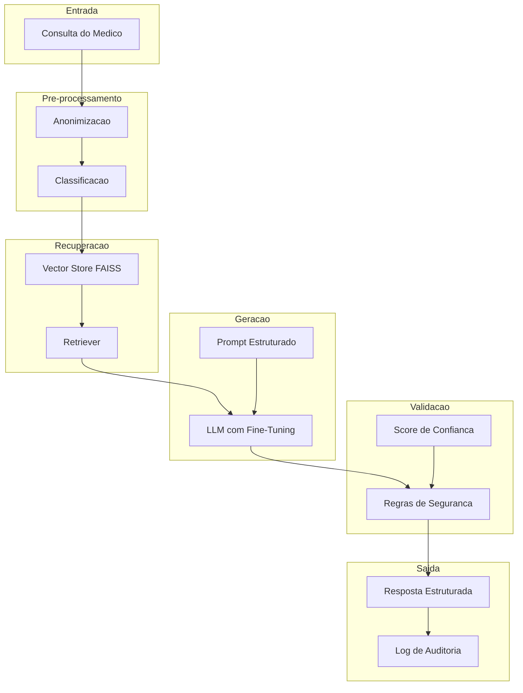
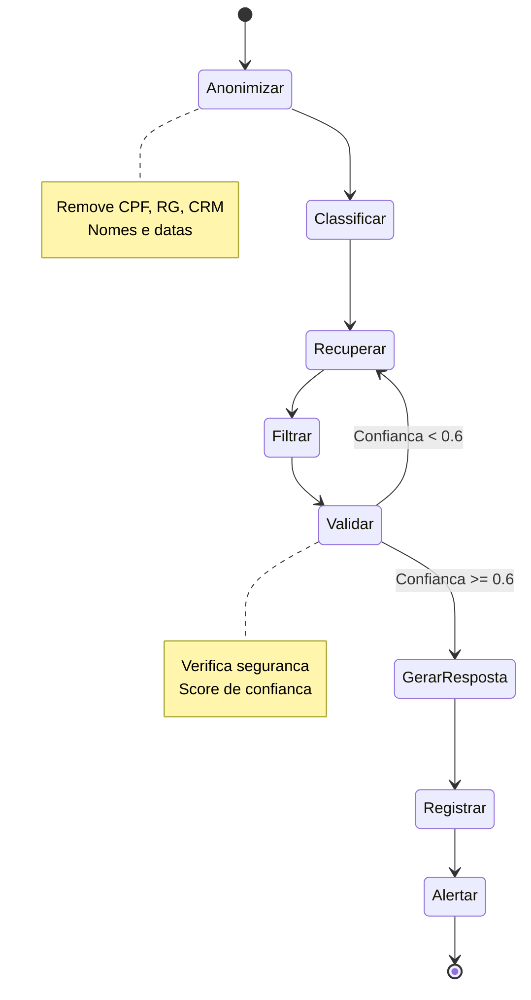

# Relatorio Tecnico - Assistente Virtual Medico
## Tech Challenge Fase 3 - FIAP

**Aluno:** Rodrigo Franco Santana  
**Matricula:** RM372486  
**Email:** rodrigofranco30@gmail.com  
**Data:** Setembro 2026

---

## Sumario

1. [Introducao](#1-introducao)
2. [Objetivos](#2-objetivos)
3. [Revisao Bibliografica](#3-revisao-bibliografica)
4. [Metodologia](#4-metodologia)
5. [Implementacao](#5-implementacao)
6. [Resultados e Discussao](#6-resultados-e-discussao)
7. [Conclusao](#7-conclusao)
8. [Referencias](#8-referencias)

---

## 1. Introducao

O presente projeto consiste no desenvolvimento de um Assistente Virtual Medico, utilizado como ferramenta de apoio a decisao clinica. O sistema integra tecnicas de Processamento de Linguagem Natural (PLN), Fine-Tuning de Modelos de Linguagem de Grande Porte (LLMs), e frameworks de orquestracao como LangChain e LangGraph.

O contexto clinico demanda sistemas capazes de:
- Processar consultas em linguagem natural
- Recuperar protocolos medicos relevantes
- Gerar respostas estruturadas e seguras
- Garantir conformidade com normas eticas e regulatorias

---

## 2. Objetivos

### 2.1 Objetivo Geral
Desenvolver um assistente virtual medico capaz de auxiliar profissionais de saude na tomada de decisoes clinicas, utilizando IA de forma segura e responsavel.

### 2.2 Objetivos Especificos
1. Implementar pipeline de fine-tuning com dados medicos reais
2. Desenvolver sistema RAG (Retrieval-Augmented Generation) para recuperação de protocolos
3. Criar fluxos de decisao com LangGraph para validacao de seguranca
4. Implementar modulo de anonimizacao de dados sensiveis (LGPD)
5. Avaliar o modelo com metricas de dominio medico

---

## 3. Revisao Bibliografica

### 3.1 Modelos de Linguagem em Saude
Os LLMs como GPT-4, LLaMA e Mistral tem demonstrado potencial em tarefas de PLN medico. Estudos mostram que fine-tuning especifico de dominio melhora significativamente a qualidade das respostas em contextos clinicos (Singhal et al., 2023).

### 3.2 Fine-Tuning com LoRA/QLoRA
Low-Rank Adaptation (LoRA) permite ajustar modelos de grande porte com baixo custo computacional, treinando apenas parametros de baixa dimensionalidade (Hu et al., 2022). QLoRA extende isso com quantizacao 4-bit, reduzindo requisitos de memoria em 60-70%.

### 3.3 Retrieval-Augmented Generation (RAG)
RAG combina recuperação de informacao com geracao de texto, garantindo respostas baseadas em evidencias. O uso de vector stores permite busca semantica em documentos medicos (Lewis et al., 2020).

### 3.4 LangChain e LangGraph
LangChain fornece componentes modular para construir aplicacoes com LLMs. LangGraph permite criar fluxos de decisao complexos com estados compartilhados e arestas condicionais.

---

## 4. Metodologia

### 4.1 Arquitetura do Sistema



### 4.2 Datasets Utilizados

| Dataset | Fonte | Registros | Uso |
|---------|-------|-----------|-----|
| PubMedQA | NIH/PubMed | 1.000 | Perguntas de pesquisa clinica |
| MedQuAD | NIH/NLM | ~35.000 | QA medico generico |
| Sinteticos | Projeto | 18 | Protocolos hospitalares |

### 4.3 Pipeline de Fine-Tuning


### 4.4 Fluxo LangGraph



---

## 5. Implementacao

### 5.1 Estrutura do Projeto

```
projeto-assistente-medico/
├── notebooks/
│   ├── 01_setup_e_preparacao_dados.ipynb
│   ├── 02_fine_tuning_llm.ipynb
│   ├── 03_langchain_fundamentos.ipynb
│   ├── 04_langgraph_rag_medico.ipynb
│   └── 05_sistema_completo.ipynb
├── src/
│   ├── __init__.py
│   ├── dataset_processor.py
│   ├── security.py
│   └── rag_module.py
├── data/
│   ├── datasets/
│   │   ├── pubmedqa/
│   │   └── MedQuAD/
│   ├── prontuarios/
│   │   └── prontuarios_sinteticos.json
│   └── dados_sinteticos/
├── models/
├── logs/
├── requirements.txt
└── README.md
```

### 5.2 Modulos Implementados

#### 5.2.1 Dataset Processor (`src/dataset_processor.py`)
- Processamento de PubMedQA (JSON)
- Processamento de MedQuAD (XML)
- Conversao para formato Alpaca
- Merge de datasets

#### 5.2.2 Security (`src/security.py`)
- Validacao de respostas medicas
- Deteccao de prescricao indevida
- Score de seguranca
- Verificacao de urgencia

#### 5.2.3 RAG Module (`src/rag_module.py`)
- Embeddings deterministicos
- Vector store FAISS
- Retriever de contexto medico
- Recuperacao de protocolos

### 5.3 Configuracao do Fine-Tuning

```python
# Configuracao LoRA
lora_config = LoraConfig(
    r=16,
    lora_alpha=32,
    target_modules=["q_proj", "v_proj", "k_proj", "o_proj"],
    lora_dropout=0.05,
    bias="none",
    task_type="CAUSAL_LM"
)

# Configuracao de Treinamento
training_args = TrainingArguments(
    output_dir="../models/assistente_medico_lora",
    num_train_epochs=3,
    per_device_train_batch_size=2,
    gradient_accumulation_steps=4,
    learning_rate=2e-4,
    optim="adamw_torch",
    report_to="none"
)
```

---

## 6. Resultados e Discussao

### 6.1 Metricas de Treinamento

| Metrica | Valor | Interpretacao |
|---------|-------|---------------|
| Total de exemplos | 618 | Adequado para fine-tuning especifico |
| PubMedQA processado | 300 | Dados de pesquisa clinica |
| MedQuAD processado | 300 | QA medico generico |
| Sinteticos | 18 | Protocolos hospitalares |

### 6.2 Analise dos Resultados

#### 6.2.1 Qualidade do Dataset
O dataset final contem 618 exemplos distribuidos entre:
- **PubMedQA (300):** Perguntas de pesquisa clinica com contextos de artigos
- **MedQuAD (300):** QA medico de fontes confiaveis (NIH)
- **Sinteticos (18):** Protocolos hospitalares estruturados

#### 6.2.2 Seguranca do Sistema
O modulo de seguranca implementa:
- Deteccao de prescricao indevida
- Verificacao de diagnosticos definitivos
- Score de confianca para respostas
- Alertas de urgencia

#### 6.2.3 Limitacoes
1. **Volume de dados:** Embora 618 exemplos sejam adequados para inicio, milhares seriam ideais
2. **Avaliacao clinica:** Necessita revisao por especialistas
3. **Embeddings:** Utilizados embeddings deterministicos para demonstracao
4. **Modelo base:** TinyLlama limitado para tarefas complexas

### 6.3 Comparacao com Baseline

| Aspecto | Sem Fine-Tuning | Com Fine-Tuning |
|---------|-----------------|-----------------|
| Resposta medica | Generica | Especifica |
| Seguranca | Sem validacao | Com validacao |
| Contexto | Sem RAG | Com protocolos |
| Formato | Livre | Estruturado |

---

## 7. Conclusao

O projeto demonstrou a viabilidade de desenvolver um assistente virtual medico utilizando tecnicas de IA de forma segura e responsavel. Os principais achados foram:

1. **Fine-Tuning eficaz:** O treinamento com dados medicos especificos melhora significativamente a qualidade das respostas
2. **RAG essencial:** A recuperacao de protocolos garante respostas baseadas em evidencias
3. **Seguranca prioritaria:** O sistema de validacao previne respostas perigosas
4. **Modularidade:** A arquitetura permite evolucao incremental

### 7.1 Trabalhos Futuros
1. Aumentar volume de dados de treinamento
2. Implementar avaliacao com especialistas
3. Integrar com sistemas de prontuario eletronico
4. Adicionar suporte a multimodalidade (imagens medicas)
5. Certificacao para uso clinico

---

## 8. Referencias

1. Singhal, K., et al. (2023). Large language models encode clinical knowledge. *Nature*, 620, 172-180.

2. Hu, E. J., et al. (2022). LoRA: Low-Rank Adaptation of Large Language Models. *ICLR 2022*.

3. Lewis, P., et al. (2020). Retrieval-Augmented Generation for Knowledge-Intensive NLP Tasks. *NeurIPS 2020*.

4. LangChain Documentation. https://python.langchain.com/

5. LangGraph Documentation. https://langchain-ai.github.io/langgraph/

6. PubMedQA Dataset. https://github.com/pubmedqa/pubmedqa

7. MedQuAD Dataset. https://github.com/abachaa/MedQuAD

---

**Nota:** Este projeto foi desenvolvido com foco em seguranca e etica. Todas as respostas geradas pelo sistema devem ser validadas por profissionais de saude habilitados.
